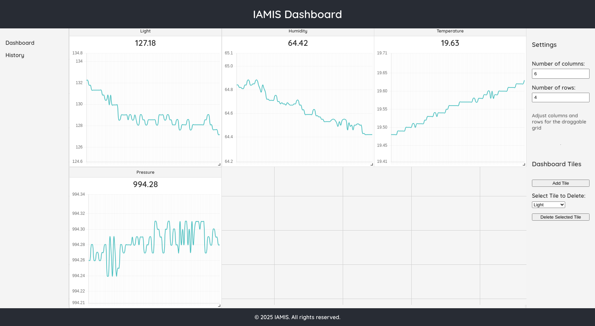
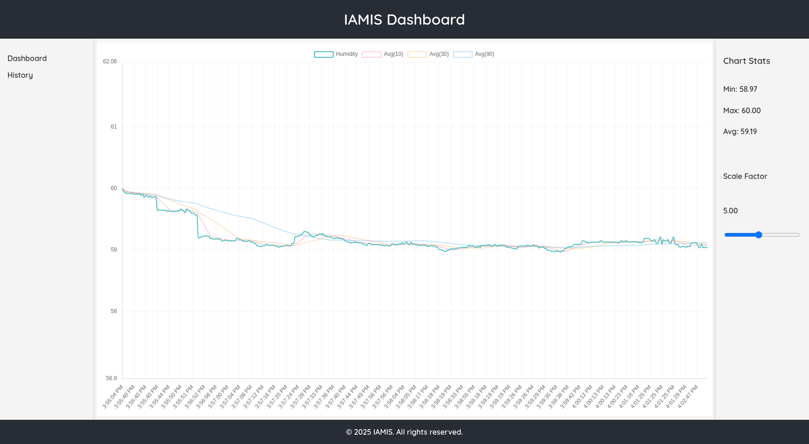

# iamis-frontend

**iamis-frontend** is a modern, responsive dashboard application built with React for visualizing IoT sensor data in real time. The project features a dynamic, draggable grid layout, interactive charts, and customizable settings to provide a powerful and user-friendly monitoring experience.

---

## Table of Contents

- [Overview](#overview)
- [Features](#features)
- [Tech Stack](#tech-stack)
- [Prerequisites](#prerequisites)
- [Installation](#installation)
- [Configuration](#configuration)
- [Running the Application](#running-the-application)
- [Project Structure](#project-structure)
- [License](#license)
- [Contact](#contact)

---

## Overview

The **iamis-frontend** application serves as the user interface for the IAMIS dashboard. It connects to the backend API to fetch sensor data and dashboard layouts, offering a real-time view of sensor readings, dynamic charts with rolling averages, and customizable grid layouts. Users can add, remove, and rearrange dashboard tiles as well as adjust various settings to tailor the experience.





---

## Features

- **Dynamic Dashboard Layout:**
  Use a draggable grid system to rearrange dashboard tiles.

- **Real-Time Data Visualization:**
  Interactive charts display real-time sensor data along with computed rolling averages.

- **Responsive Design:**
  Fully responsive UI that adapts to various screen sizes and devices.

- **Customizable Settings:**
  Adjust grid dimensions, chart scale factors, and other settings directly from the interface.

- **Clean & Modern UI:**
  Intuitive and accessible design using modern CSS techniques and component-driven architecture.

- **API Integration:**
  Communicates with the backend API using Axios to fetch sensor data, layouts, and settings.

---

## Tech Stack

- **React** – Core framework for building the user interface.
- **React Router** – For client-side routing and navigation.
- **Axios** – For making HTTP requests to the backend API.
- **Chart.js** – For rendering interactive charts.
- **react-grid-layout** – Provides the draggable and resizable grid layout.
- **PWA & Responsive CSS** – Modern CSS variables and responsive design practices.

---

## Prerequisites

Before you begin, ensure you have met the following requirements:
- **Node.js** (v14 or higher)
- **npm** (v6 or higher) or **yarn**

---

## Installation

1. **Clone the Repository:**

   ```bash
   git clone https://github.com/cirelote/iamis-frontend.git
   cd iamis-frontend
   ```

2. **Install Dependencies:**

   Using npm:
   ```bash
   npm install
   ```
   Or using yarn:
   ```bash
   yarn install
   ```

---

## Configuration

The application connects to a backend API. Configure the API endpoint using environment variables:

1. Create a `.env` file in the root directory of the project.
2. Add the following variable (modify the URL as needed):

   ```dotenv
   REACT_APP_API_URL=http://localhost:8000
   ```

This variable is used by the API service (`src/services/api.js`) to determine the base URL for all API calls.

---

## Running the Application

To start the development server, run:

```bash
npm start
```
or
```bash
yarn start
```

This command runs the app in development mode. Open [http://localhost:3000](http://localhost:3000) to view it in the browser. The page will reload when you make changes.

To build the application for production, run:

```bash
npm run build
```
or
```bash
yarn build
```

The build artifacts will be stored in the `build/` directory.

---

## Project Structure

Below is an overview of the project structure:

```
iamis-frontend/
├── config-overrides.js         # Custom configuration overrides (e.g., for webpack or Babel)
├── LICENSE                     # Project license (MIT)
├── package.json                # NPM package configuration and scripts
├── package-lock.json           # Lock file for dependency versions
├── README.md                   # Project documentation
├── public/                     # Public static assets and HTML template
│   ├── android-chrome-192x192.png
│   ├── android-chrome-512x512.png
│   ├── apple-touch-icon.png
│   ├── favicon-16x16.png
│   ├── favicon-32x32.png
│   ├── favicon.ico
│   ├── index.html              # Main HTML file
│   ├── robots.txt              # SEO and crawler configuration
│   └── site.webmanifest        # Web app manifest for PWA settings
└── src/                        # Source code for the React application
    ├── App.css                 # Global application styles
    ├── App.js                  # Root component and router configuration
    ├── components/             # Reusable UI components
    │   ├── Chart.css
    │   ├── Chart.js
    │   ├── DraggableGrid.css
    │   ├── DraggableGrid.js
    │   ├── Footer.css
    │   ├── Footer.js
    │   ├── FullscreenChart.js
    │   ├── Header.css
    │   ├── Header.js
    │   ├── LeftSidebar.css
    │   ├── LeftSidebar.js
    │   ├── MiniTileChart.js
    │   ├── RightSidebar.css
    │   ├── RightSidebar.js
    │   ├── SensorCard.css
    │   └── SensorCard.js
    ├── context/                # Global state management using React Context
    │   ├── DashboardContext.js
    │   └── GlobalSettingsContext.js
    ├── index.css               # Global CSS resets and styles
    ├── index.js                # Application entry point
    ├── pages/                  # Page-level components/views
    │   ├── Dashboard.css
    │   ├── Dashboard.js
    │   ├── NotFound.css
    │   └── NotFound.js
    ├── services/               # API service for backend communication
    │   └── api.js
    ├── shims/                  # Polyfills and shims for compatibility
    │   └── process-shim.js
    └── utils/                  # Utility functions
        └── rollingAverages.js
```

---

## License

This project is licensed under the [MIT License](LICENSE).

---

## Contact

For any questions or further information, please contact:

- **Project Maintainer:** [Bohdan Lutsenko](mailto:bohdan.lutsen.co@gmail.com)
- **GitHub:** [cirelote](https://github.com/cirelote)
